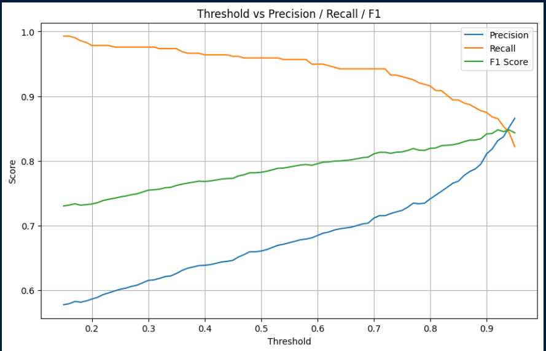
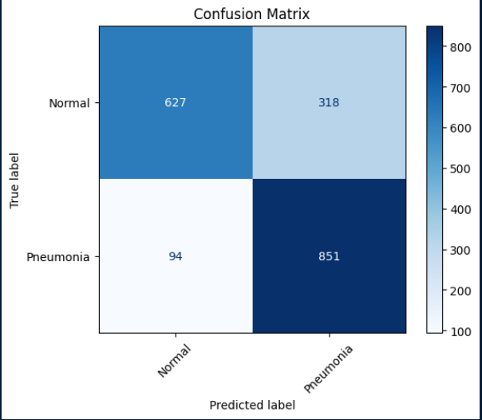

## 🩺 Binary Classification of Chest X-rays: Pneumonia vs Normal (VGG16 + Transfer Learning)
**Author: Ramalah Amir**

This project focuses on binary classification of chest X-ray images into **Pneumonia** and **Normal** categories using a **VGGNet16** architecture with **transfer learning**. The goal was to maximize model performance — especially **recall** — using smart training strategies like **K-Fold cross-validation**, **soft voting ensembles**, and **threshold tuning**.

While strong results were achieved, we faced some real-world limitations:

* **Limited labeled data**
* **Class imbalance**
* **Small test set size**
  To address this, we also tested our model on a **separate external dataset** to simulate real-world generalization.

📌 **Dataset Used**: [Kaggle Dataset](https://www.kaggle.com/datasets/paultimothymooney/chest-xray-pneumonia)
📌 **Drive Files**: [Best Model Stats](https://drive.google.com/drive/folders/1vb6lzz14gVDqY7lbtbiGbmUHAqw3owtW?usp=sharing)

---

## 📂 Dataset Exploration & Preparation

* Images labeled as either `Normal (0)` or `Pneumonia (1)`
* Original Train set: `Counter({0: 1341, 1: 3875})`
* Original Validation set: `Counter({0: 234, 1: 390})`
* The test set was too small — so a new **external dataset** was used for better evaluation

### ✅ Data Checks:

* Verified image sizes for consistency
* Analyzed class distributions
* Confirmed imbalance in the train set

### ✅ Augmentation Strategy (Using Augmentor):

* Light augmentation on **Normal** class
* A little stronger augmentation on **Pneumonia**
* Helps balance data + improve generalization

### ✅ Safe Medical Augmentations:

* Brightness/Contrast (small changes)
* RandomRotation (±10°)
* Zoom (slight, preserves anatomy)

> In medical tasks, **false negatives** (missing pneumonia) are worse than false positives. So augmenting Pneumonia more helped the model generalize to its varied forms.

---

## 🧠 Model Architecture & Fine-Tuning

### ✅ Model: **VGG16** pretrained on ImageNet

* Only the classifier was changed: `nn.Linear(4096, 1)`
* **Block 5 was unfrozen** for fine-tuning

### ⚙️ Optimizer Configuration

* Classifier: `lr = 1e-4`
* Block 5: `lr = 1e-6` (fine-tune gently)

---

## 🔁 K-Fold Cross Validation

To prevent overfitting to the small original validation set:

* Switched to **3-Fold CV** using just the training set
* Trained 3 separate models on different folds
* Picked the **best-performing model** from each

---

## 🧪 Validation Set Preparation

We created a **balanced and reserved validation set** by combining:

* 200 images per class from the test set were added to the original validation images
  → Final val set: approx. **400 Normal + 400 Pneumonia**

✅ This validation set was **not used for training** — only for threshold tuning and soft-voting after model training.

---

## 🤖 Soft Voting Ensemble + Threshold Tuning

* Predictions from 3 models were **soft-voted** (average of sigmoid outputs)
* Threshold tuning done using the reserved validation set
* Tested thresholds from `0.15 → 0.95`

📌 Final threshold = `**0.79**`
→ Best **recall** without heavily sacrificing F1 score

---

## 🎯 Final Model Focus

During training:

* Prioritized **high recall** to avoid missing pneumonia cases
* Allowed slight drop in precision if needed

During evaluation:

* Tuned for better **balance**
* Carefully chose the threshold based on Precision/Recall trade-offs

### 📈 Threshold vs Precision/Recall/F1 Score
This graph helped in choosing the best decision threshold by showing how performance metrics changed across different values.


---

## 📊 Final Results (External Test Set)

```
Accuracy  : 78.20%
Precision : 72.80%
Recall  : 90.05%
F1 Score  : 80.51%
```

### 🔍 Confusion Matrix
Gives a breakdown of true positives, false positives, etc., helping visualize how the model performed on each class.



✅ These results show strong pneumonia detection — approximately **90%** of he pneumonia cases were caught!
⚠️ Precision was slightly lower, but this is a reasonable trade-off in medical contexts where recall is more critical for patient safety.

---

## 🙋‍♀️ What I Learned

* **Medical datasets** require careful preprocessing and minimal but meaningful augmentations
* Validation leakage is a real risk — **K-Fold CV** helps fight overfitting
* **Threshold tuning** can change model behavior significantly
* External test sets are vital to **simulate real-world generalization**
* Training isn't just about code — it’s also about smart decisions and trade-offs

---
